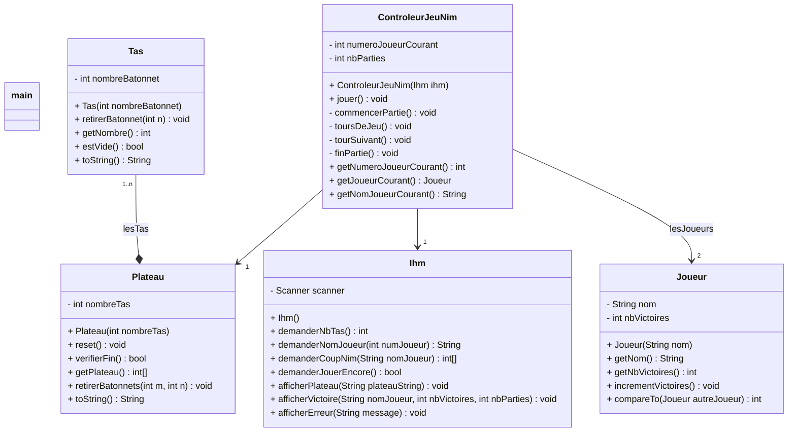

# Diagramme de cas d'utilisation

```Mermaid
flowchart LR
    Joueur[🧍‍♂️ Joueur] --- Nim([Jouer au jeu de Nim])
```

# Scénario

## **UC : Jouer au jeu de Nim**
**Périmètre** : Le jeu <br>
**Niveau** : But utilisateur <br>
**Acteur principal** : Joueur<br>
**Pré-condition** : Aucune<br>
**Post-conditions** : Aucune

### Scénario nominal

1. L'utilisateur lance le programme
2. Le système demande à l'utilisateur le nombre de tas qu'il souhaite
3. L'utilisateur répond à la question
4. Le système enregistre le nombre de tas
5. Le système demande le nom du joueur 1
6. Le joueur 1 répond
7. Le système enregistre le nom du joueur 1
8. Le système demande au joueur 2
9. Le joueur 2 répond
10. Le système enregistre le nom du joueur 2
11. Le système affiche les tas ainsi que le nom du joueur qui doit jouer
12. Le joueur choisi dans quel tas il souhaite prendre un certain nombre d'allumette 
13. Le système vérifie si la partie est gagné
14. Le système affiche le vainqueur et demande si l'utilisateur souhaite refaire une partie ("y" or "n")
15. L'utilisateur répond "y" ou "n"
16. Le système retourne au point 8 du scénario nominal et incrément le classement entre les deux joueur


### Extensions

4. a Le joueur répond autre chose ou un nombre inférieur à 1
    1. Le système affiche un message d'erreur "le nombre de tas doit être un entier supérieur à 1"
    2. Retour au point 2 du scénario nominal

7. a L'utilisateur répond à la question avec une chaîne vide
    1. Le système affiche un message d'erreur "Le nom ne peut pas être vide"
    2. Retour au point 5 du scénario nominal

10. a L'utilisateur répond à la question avec une chaîne vide
    1. Le système affiche un message d'erreur "Le nom ne peut pas être vide"
    2. Retour au point 8 du scénario nominal

13. a Le joueur n'a pas entré une réponse au format $m\ n$
    1. Le système affiche un message d'erreur "Le format de la réponse doit être $n\ m$"
    2. Retour au point 11 du scénario nominal avec le même joueur

13. b Le joueur a demandé un tas qui n'existe pas
    1. Le système affiche un message d'erreur "Tas inexistant"
    2. Retour au point 11 du scénario nominal avec le même joueur

13. c Le joueur veut prendre un nombre d'allumette supérieur au nombre contenue dans le tas
    1. Le système affiche un message d'erreur "Pas assez d'allumette dans ce tas"
    2. Retour au point 11 du scénario nominal avec le même joueur

13. d La partie n'est pas fini 
    1. Retour au point 11 du scénario nominal avec l'autre joueur

16. a L'utilisateur à répondu autre chose que y ou n
    1. Le système affiche un message d'erreur "Répondre avec "y" ou "n""
    2. Retour au point 14 du scénario nominal

16. b L'utilisateur à choisi d’arrêter de jouer
    1. Le système affiche le classement entre les deux joueur
    2. Le système attend une action de l'utilisateur pour arrêter le programme

# Diagrammes de Classes

## Jeu de Nim (Itération 1)




Dans la class ControleurJeuNim la méthode jouer est celle qui est appeler par le main à voir ce qu'elle fait en réalité (peut être l'initialisation du nb de tas et du nom des joueurs)

```java
public static void main(String[] args) {
    Ihm ihm = new Ihm();
    ControleurJeuNim controleurJeuNim=new ControleurJeuNim(ihm);
    controleurJeuNim.jouer();
}
```


Dans la class Ihm la méthode demanderNomJoueur, elle demande pour un seul joueur 

Dans la class Ihm la méthode demanderCoupNim, je sais pas si on renvoie  tableau de int


# Répartition des tâches
## Itération 1

### Publication du sujet

Dany : Premier jet du diagramme des UC et scénario

Nathan : Review et premier jet du diagramme de classe

### Premier CM avec des questions

Dany : Review et amélioration du diagramme de classe

Agathe, Nathan, Dany : Review des diagrammes

Agathe : Finalisation du diagramme de Classes

Nathan : Développement du code

Nathan et Dany : Debug

Dany : Essaie de création d'une UI mais pas réussi


# Utilisation de l'IA
## Itération 1

- Nathan : Génération de Javadoc sur les fonctions simples (ex set-get, afficherErreur etc.) [Lien vers la conversation ChatGPT](https://chat.openai.com/share/2db9f292-a089-4935-a584-acebe06836a9)
- Dany : 
- Agathe : Aucun usage
