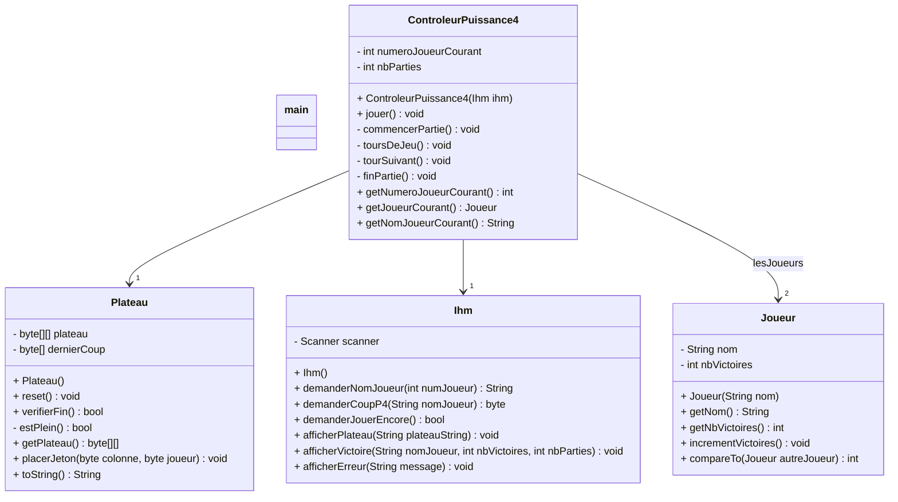

# Diagramme de cas d'utilisation

```Mermaid
flowchart LR
    Joueur[🧍‍♂️ Joueur] --- Puissance([Jouer au jeu de Puissance 4])
```

# Scénario

## **UC : Jouer au Puissance 4**
**Périmètre** : Le jeu <br>
**Niveau** : But utilisateur <br>
**Acteur principal** : Joueur<br>
**Pré-condition** : Aucune<br>
**Post-conditions** : Aucune

### Scénario nominal

1.  L'utilisateur lance le programme
2.  Le système demande le nom du joueur 1
3.  Le joueur 1 répond
4.  Le système enregistre le nom du joueur 1
5.  Le système demande au joueur 2
6.  Le joueur 2 répond
7.  Le système enregistre le nom du joueur 2
8.  Le système affiche le plateau ainsi que le nom du joueur qui doit jouer
9.  Le joueur choisi dans quelle colonne il souhaite mettre un jeton 
10. Le système vérifie si la partie est gagné
11. Le système affiche le vainqueur et demande si l'utilisateur souhaite refaire une partie ("y" or "n")
12. L'utilisateur répond "y" ou "n"
13. Le système retourne au point 8 du scénario nominal et incrémente le nombre de partie


### Extensions

- 3.a L'utilisateur répond à la question avec une chaîne vide
    1. Retour au point 2 du scénario nominal

- 6.a L'utilisateur répond à la question avec une chaîne vide
    1. Retour au point 5 du scénario nominal

- 9.a L'utilisateur choisit un numéro de colonne $n \notin \lbrace x \in \N, \text{ tq } 1 \le x \le 7 \rbrace$
    1. Le systeme affiche un message d'erreur
    2. retour au point 8

- 9.b L'utilisateur choisit un numéro de colonne valide, mais la colonne est pleine
    1. Le systeme affiche un message d'erreur
    2. retour au point 8

- 10.a La partie n'est pas finie
    1. Le systeme change le joueur qui doit jouer
    2. retour au point 8 du scénario nominal

- 12.a l'utilisateur répond autre chose que 'y' ou 'n'
    1. le systeme affiche un message d'erreur
    2. retour au point 11 du scénario nominal

- 12.b L'utilisateur répond 'n'
    1. le systeme affiche le gagnant et le nombre de victoire du gagnant
        - Il n'y a pas de gagnant
            1. le systeme affiche ex aequo et le nombre de victoire des joueurs (il est identique pour les deux)
            2. Retour au point 2 de l'extension 12.b
    2. fin du programme


# Modèle de Conception

## Puissance 4 (Itération 2)




```java
public static void main(String[] args) {
    Ihm ihm = new Ihm();
    ControleurPuissance4 controleurPuissance4=new ControleurPuissance4(ihm);
    controleurPuissance4.jouer();
}
```

# Répartition des tâches
## Itération 2

### 14/03/2024 (Publication du sujet)

Nathan, Dany, Agathe : review du sujet et brainstorming (check de la victoire etc)

### 16/03/2024

Nathan : Diagramme de classe, Cas d'utilisation

Dany : review du Diagramme

# Utilisation de l'IA
## Itération 2

- Nathan : Aucun Usage
- Dany : Aucun Usage
- Agathe : Aucun Usage