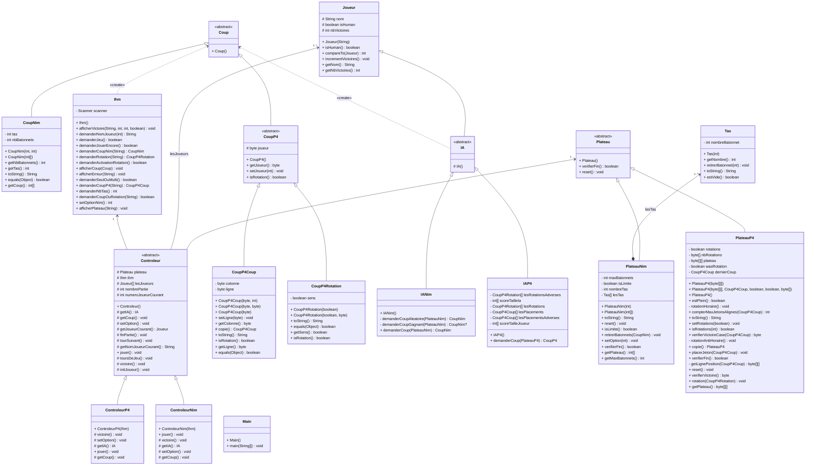

# Diagramme de cas d'utilisation


```Mermaid
graph LR
    Joueur[🧍‍♂️ Joueur] --- Sélectionner
    Sélectionner -. include .- Nim([Nim])
    Sélectionner -. include .- Puissance([Puissance 4])
```

# Scénario

## **UC : Sélectionner**
**Périmètre** : Le jeu <br>
**Niveau** : But utilisateur <br>
**Acteur principal** : Joueur<br>
**Pré-condition** : Aucune<br>
**Post-conditions** : Aucune

### Scénario nominal

1. L'utilisateur lance le programme
2. Le système demande à l'utilisateur à quel jeu il veux jouer
3. L'utilisateur répond à la question
4. Le système demande à l'utilisateur s'il est seul ou à deux
5. L'utilisateur répond à la question
6. UC: Nim

### Extensions

4\. b L'utilisateur à répondu autre chose

1. Le système affiche un message d'erreur
2. Retour au point 2 du scénario nominal

6\. a L'utilisateur à répondu puissance 4

1. UC : Puissance 4


## **UC : Nim**
**Périmètre** : Le jeu <br>
**Niveau** : But utilisateur <br>
**Acteur principal** : Joueur<br>
**Pré-condition** : Aucune<br>
**Post-conditions** : Aucune

### Scénario nominal

1. L'utilisateur lance le programme
2. Le système demande à l'utilisateur le nombre de tas qu'il souhaite
3. L'utilisateur répond à la question
4. Le système enregistre le nombre de tas
5. Le système demande le nom du joueur 1
6. Le joueur 1 répond
7. Le système enregistre le nom du joueur 1
8. Le système demande au joueur 2
9. Le joueur 2 répond
10. Le système enregistre le nom du joueur 2
11. Le système demande au joueur le nombre maximal de bâtonnet retirer par coup
12. Le joueur répond
13. Le système enregistre la réponse du joueur
14. Le système affiche les tas ainsi que le nom du joueur qui doit jouer
15. Le joueur choisi dans quel tas il souhaite prendre un certain nombre d'allumette 
16. Le système vérifie si la partie est gagné
17. Le système affiche le vainqueur et demande si l'utilisateur souhaite refaire une partie ("y" or "n")
18. L'utilisateur répond "y" ou "n"
19. Le système retourne au point 11 du scénario nominal et incrément le classement entre les deux joueur

### Extensions

4\. a Le joueur répond autre chose ou un nombre inférieur à 1
1. Le système affiche un message d'erreur "le nombre de tas doit être un entier supérieur à 1"
2. Retour au point 2 du scénario nominal

7\. a L'utilisateur répond à la question avec une chaîne vide
1. Le système affiche un message d'erreur "Le nom ne peut pas être vide"
2. Retour au point 5 du scénario nominal

8\. a Le joueur joue seul
1. Retour au point 11 du scénario nominal

10\. a L'utilisateur répond à la question avec une chaîne vide
1. Le système affiche un message d'erreur "Le nom ne peut pas être vide"
2. Retour au point 8 du scénario nominal

13\. a Le joueur répond autre chose ou un nombre inférieur à 0
1. Le système affiche un message d'erreur "la limite doit etre un entier superieur ou égal à 0"
2. Retour au point 11 du scénario nominal

16\. a Le joueur n'a pas entré une réponse au format $m\ n$
1. Le système affiche un message d'erreur "Le format de la réponse doit être $n\ m$"
2. Retour au point 14 du scénario nominal avec le même joueur

16\. b Le joueur a demandé un tas qui n'existe pas
1. Le système affiche un message d'erreur "Tas inexistant"
2. Retour au point 14 du scénario nominal avec le même joueur

16\. c Le joueur veut prendre un nombre d'allumette supérieur au nombre contenue dans le tas
1. Le système affiche un message d'erreur "Pas assez d'allumette dans ce tas"
2. Retour au point 14 du scénario nominal avec le même joueur

16\. d Le joueur veut prendre un nombre d'allumette supérieur à la limite
1. Le système affiche un message d'erreur "Le nombre max est ..."
2. Retour au point 14 du scénario nominal avec le même joueur

16\. e La partie n'est pas fini 
1. Retour au point 14 du scénario nominal avec l'autre joueur

19\. a L'utilisateur à répondu autre chose que y ou n
1. Le système affiche un message d'erreur "Répondre avec "y" ou "n""
2. Retour au point 17 du scénario nominal

19\. b L'utilisateur à choisi d’arrêter de jouer
1. Le système affiche le classement entre les deux joueur
2. Le système attend une action de l'utilisateur pour arrêter le programme


## **UC : Puissance 4**
**Périmètre** : Le jeu <br>
**Niveau** : But utilisateur <br>
**Acteur principal** : Joueur<br>
**Pré-condition** : Aucune<br>
**Post-conditions** : Aucune

### Scénario nominal

1.  L'utilisateur lance le programme
2.  Le système demande le nom du joueur 1
3.  Le joueur 1 répond
4.  Le système enregistre le nom du joueur 1
5.  Le système demande le nom du joueur 2
6.  Le joueur 2 répond
7.  Le système enregistre le nom du joueur 2
8.  Le système demande aux joueurs s'ils veulent activer la rotation 
9.  Le joueur répond
10.  Le système enregistre la réponse du joueur
11.  Le système affiche le plateau ainsi que le nom du joueur qui doit jouer
12.  Le joueur choisi dans quelle colonne il souhaite mettre un jeton 
13. Le système vérifie si la partie est gagné
14. Le système affiche le vainqueur et demande si l'utilisateur souhaite refaire une partie ("y" or "n")
15. L'utilisateur répond "y" ou "n"
16. Le système retourne au point 8 du scénario nominal et incrémente le nombre de partie


### Extensions

4\. a L'utilisateur répond à la question avec une chaîne vide
1. Le système affiche un message d'erreur "Le nom ne peut pas être vide"
2. Retour au point 2 du scénario nominal

5\. a Le joueur joue seul
1. Retour au point 8 du scénario nominal

7\. a L'utilisateur répond à la question avec une chaîne vide
1. Le système affiche un message d'erreur "Le nom ne peut pas être vide"
2. Retour au point 5 du scénario nominal


10\. a l'utilisateur répond autre chose que 'y' ou 'n'
1. le système affiche un message d'erreur
2. retour au point 8 du scénario nominal

13\. a L'utilisateur choisit un numéro de colonne entre 1 et 7
1. Le système affiche un message d'erreur
2. retour au point 11 du scénario nominal

13\. b L'utilisateur choisit un numéro de colonne valide, mais la colonne est pleine
1. Le système affiche un message d'erreur
2. retour au point 11 du scénario nominal

13\. c L'utilisateur choisit de faire tourner le plateauNim
1. Le système vérifie que l'option est activée
    1. Le système affiche un message d'erreur
    2. retour au point 11 du scénario nominal
2. Le système fait tourner la grille
3. retour au point 11 du scénario nominal

13\. a La partie n'est pas finie
1. Le système change le joueur qui doit jouer
2. retour au point 11 du scénario nominal

16\. a l'utilisateur répond autre chose que 'y' ou 'n'
1. le système affiche un message d'erreur
2. retour au point 14 du scénario nominal

16\.b L'utilisateur répond 'n'
1. le système affiche le gagnant et le nombre de victoire du gagnant
    - Il n'y a pas de gagnant
        1. le système affiche ex æquo et le nombre de victoire des joueurs (il est identique pour les deux)
        2. Retour au point 2 de l'extension 16.b
2. fin du programme


# Modèle de Conception




<!-- [![](https://mermaid.ink/img/pako:eNqlGNtu2zb0VwT1RanjAAPyZBQZ3LRbHTSN0QR9ifNAy0zMzqI8kspWdPmifcLe-mU9JHV4E-UEWALY4jmH536Tv5d1u6HlrFzxFa93RMp3jDwI0qx4AX8bJmitWMuLtzeaQsMMVXHeciXaHe1E8d3C9d-bN2QtlSC1Ojuz0ElAWR0VFviqWO6IoqQr9vYbwYttU7Btg8eLtoNrt3fFjkr7LBHFuCp426wFXRKhGI3gXUNFay-ct50gXCH6garFHPRYzAMI0OwB9tiyDUIlVVd7bXgCB-qIL6DtGQnuGbcKJRcV0F937NHeSVh-apuU67USjD-gD78CVmQ4ynf0gnYJ4pHVqoXAJWDGWa97hHjKR_UTazCwkxhcQZAwkHnNRhQY-v6AlwcxGdFzeZpTc3kaajmq0QH5kaZ5M1-gZbd_vjoMh5HbSRQMoIIUP9Z57oMQYG7vEDw1taCIDI98_ZaolnOqJF7W-eehoAvDcjG4G5LAVGtzc5Ck9M-O7GR1tf4KPeOoWLcQCsIDVr2tRssRg304DzkMwutju_6mqIkPFuHEVymQaTTCpYMb9_mwTQomP7eK9LkQqZ7RMQzsJIBVWlgmNhFWf46iffCMWXW702GJYDv2wEOLPupzfzm0yDjcXI-88AqY7k178qKfDe24d4wcq0Ls60PZkHEp8k_d6uT2DFLPpfjYv1OUC47i8v9n8DVwGXrgYO6Epi7mh7MbBuA83wwW86gVmGPlrdzQhvAN1fNjPwfxttn1QxZIj7BF5C78Th64HjoZ8l9RYEg_zjdROezN-hQoHAfPTng8yfnmkQpJw8YFFLJuBb0hbLejC_IiPjGR_rQEoH9NG8rVCyie1eUi6jw5Py1PsdZyXtqGYd2GQb2uCRSvAGHmG4nI_T2rt1R8wZlmc9i0nf7D1UrYD1A1t2zYJhhXABLZrSLJc4fUw_A91z4YJ8KZZPknieLJXOWEdD6iKfkcttFHgxlvSOggEwP9EfsB0e-F0E5AuTlXXdNud9VddjvFDhsKuR3rH3ZV5_j1YJaGPK66gS8SiW5dscUf8EGb-ozLGJV0IpsBPvP6jMB72I7sWS_abtr2_ZTJD12DqvVr9xpTUvrOaKiGzqvbZk-ghNrKSo6sYbwWpvocv2ow2iCLB-3bbDLhHcczKrlLwoIxo0-VnyqNPlq2epUa2ezw9eWZXQXD4dlDM2H3jIrfWMYpoDRV1XNCo0HgYVW0dcTwdClsyN_JGjgNAvuRNUzRaGs0L1o3fpWER9soHezAVB2aNXFSck5QED3hF9K-ccT3_eY-2OQOuhhSxAclWEQN5jJwy2j2uKY-CAI0Ab173N55d-dwx0GLcK06fDB0OQ7DrUako85ehlL8nMcALnrl9qz-IjJuuuFUhEYlOLN9yi1LElxJh06eOq0-tIKkL1229BUV4OwLqvS0NwutjbOV9rLXDUgBZ2SVnXh-L5M2TZJkwEzBlnFOJI3U8PusN2rOFRszzO7VLmCI2OttQhhrI_YvzNqpW7GXrWQm6VMldWAPlVtqabKro21VPHwHTdeXTiw0GS7QFHxx6JkXtKawoWCxxW19bdQLMiDpCMOKH9_nJYyQDc1u5fYx_sGjmE7_OQuBRUoFZT9OZF5fHRqqJkQYQIAE0hDt3n_GSCL9HG94o-iB_URHcEAONAj1-jlgMFV6FA63CO9vLrF_4H_sIaA6K1blL6syYTQkOTl5DVS94rPBj3xZnnpf7q2Bp-LkBP0xK378C2sDSPzxn_fNIXxg-etII52_s366lcdlQwVsBZtyVpqkXpVqC9vJqpzB44aIP1blij8BHekgEb_xupwp0dHjsttvQED_eyoC6YapVlzaH13Nb69PPwEcQMt2?type=png)](https://mermaid.live/edit#pako:eNqlGNtu2zb0VwT1RanjAAPyZBQZ3LRbHTSN0QR9ifNAy0zMzqI8kspWdPmifcLe-mU9JHV4E-UEWALY4jmH536Tv5d1u6HlrFzxFa93RMp3jDwI0qx4AX8bJmitWMuLtzeaQsMMVXHeciXaHe1E8d3C9d-bN2QtlSC1Ojuz0ElAWR0VFviqWO6IoqQr9vYbwYttU7Btg8eLtoNrt3fFjkr7LBHFuCp426wFXRKhGI3gXUNFay-ct50gXCH6garFHPRYzAMI0OwB9tiyDUIlVVd7bXgCB-qIL6DtGQnuGbcKJRcV0F937NHeSVh-apuU67USjD-gD78CVmQ4ynf0gnYJ4pHVqoXAJWDGWa97hHjKR_UTazCwkxhcQZAwkHnNRhQY-v6AlwcxGdFzeZpTc3kaajmq0QH5kaZ5M1-gZbd_vjoMh5HbSRQMoIIUP9Z57oMQYG7vEDw1taCIDI98_ZaolnOqJF7W-eehoAvDcjG4G5LAVGtzc5Ck9M-O7GR1tf4KPeOoWLcQCsIDVr2tRssRg304DzkMwutju_6mqIkPFuHEVymQaTTCpYMb9_mwTQomP7eK9LkQqZ7RMQzsJIBVWlgmNhFWf46iffCMWXW702GJYDv2wEOLPupzfzm0yDjcXI-88AqY7k178qKfDe24d4wcq0Ls60PZkHEp8k_d6uT2DFLPpfjYv1OUC47i8v9n8DVwGXrgYO6Epi7mh7MbBuA83wwW86gVmGPlrdzQhvAN1fNjPwfxttn1QxZIj7BF5C78Th64HjoZ8l9RYEg_zjdROezN-hQoHAfPTng8yfnmkQpJw8YFFLJuBb0hbLejC_IiPjGR_rQEoH9NG8rVCyie1eUi6jw5Py1PsdZyXtqGYd2GQb2uCRSvAGHmG4nI_T2rt1R8wZlmc9i0nf7D1UrYD1A1t2zYJhhXABLZrSLJc4fUw_A91z4YJ8KZZPknieLJXOWEdD6iKfkcttFHgxlvSOggEwP9EfsB0e-F0E5AuTlXXdNud9VddjvFDhsKuR3rH3ZV5_j1YJaGPK66gS8SiW5dscUf8EGb-ozLGJV0IpsBPvP6jMB72I7sWS_abtr2_ZTJD12DqvVr9xpTUvrOaKiGzqvbZk-ghNrKSo6sYbwWpvocv2ow2iCLB-3bbDLhHcczKrlLwoIxo0-VnyqNPlq2epUa2ezw9eWZXQXD4dlDM2H3jIrfWMYpoDRV1XNCo0HgYVW0dcTwdClsyN_JGjgNAvuRNUzRaGs0L1o3fpWER9soHezAVB2aNXFSck5QED3hF9K-ccT3_eY-2OQOuhhSxAclWEQN5jJwy2j2uKY-CAI0Ab173N55d-dwx0GLcK06fDB0OQ7DrUako85ehlL8nMcALnrl9qz-IjJuuuFUhEYlOLN9yi1LElxJh06eOq0-tIKkL1229BUV4OwLqvS0NwutjbOV9rLXDUgBZ2SVnXh-L5M2TZJkwEzBlnFOJI3U8PusN2rOFRszzO7VLmCI2OttQhhrI_YvzNqpW7GXrWQm6VMldWAPlVtqabKro21VPHwHTdeXTiw0GS7QFHxx6JkXtKawoWCxxW19bdQLMiDpCMOKH9_nJYyQDc1u5fYx_sGjmE7_OQuBRUoFZT9OZF5fHRqqJkQYQIAE0hDt3n_GSCL9HG94o-iB_URHcEAONAj1-jlgMFV6FA63CO9vLrF_4H_sIaA6K1blL6syYTQkOTl5DVS94rPBj3xZnnpf7q2Bp-LkBP0xK378C2sDSPzxn_fNIXxg-etII52_s366lcdlQwVsBZtyVpqkXpVqC9vJqpzB44aIP1blij8BHekgEb_xupwp0dHjsttvQED_eyoC6YapVlzaH13Nb69PPwEcQMt2) -->


# Répartition des tâches
## Itération 4

### 24/03/2024 (Fin des exams)

Dany : Refactor (des problèmes de l'itération 3), IA Nim (Aléatoire)

Nathan : IA Puissance 4

Agathe : IA Nim (Gagnant)

# Utilisation de l'IA
## Itération 4

- Nathan : Aucun Usage
- Agathe : Aucun Usage
- Dany : Aucun Usage
