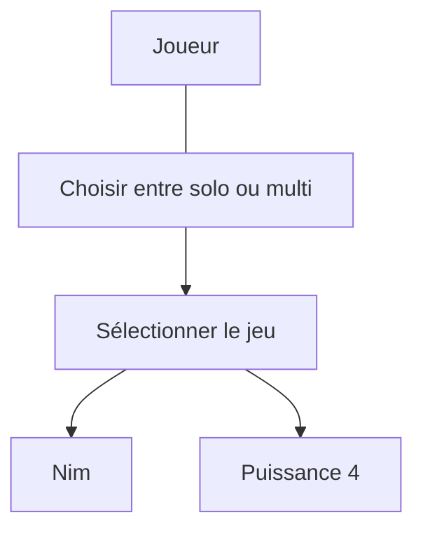

# Diagramme de cas d'utilisation

# Scénario

## **UC : Choisir entre multi et solo**
**Périmètre** : Le jeu  
**Niveau** : But utilisateur  
**Acteur principal** : Joueur 
**Pré-condition** : Aucune 
**Post-conditions** : Le joueur à choisi son mode, et peut accéder au choix du jeu

### Scénario nominal

1. L'utilisateur démarre le jeu
2. Le système demande à l'utilisateur le nombre de joueur (1 ou 2)
3. L'utilisateur choisi
4. Le système enregistre l'information

### Extensions

4. a L'utilisateur entre une autre valeur que 1 ou 2
    1. Le système affiche un message d'erreur
    2. Retour au point 2 du scénario nominal

## **UC : Sélectionner le jeu**
**Périmètre** : Le jeu  
**Niveau** : But utilisateur  
**Acteur principal** : Joueur 
**Pré-condition** : Avoir choisi le nombre de joueur 
**Post-conditions** : Le joueur à choisi son jeu

### Scénario nominal

1. Le système demande à l'utilisateur quel jeu il désire (puissance ou nim)
2. L'utilisateur choisi son jeu
3. Le système enregistre l'information

### Extensions

3. a L'utilisateur entre une autre valeur que puissance ou min
    1. Le système affiche un message d'erreur 
    2. Retour au point 1 du scénario nominal

## **UC : Jeu de Nim**
**Périmètre** : Le jeu  
**Niveau** : But utilisateur  
**Acteur principal** : Joueur 
**Pré-condition** : Avoir choisi le nombre de joueur et le jeu de Nim 
**Post-conditions** : aucune

### Scénario nominal

1. Le système demande à l'utilisateur le nombre de tas qu'il souhaite
2. L'utilisateur répond à la question
3. Le système enregistre le nombre de tas
4. Le système demande le nom du joueur 1
5. Le joueur 1 répond
6. Le système enregistre le nom du joueur 1
7. Le système demande au joueur 2
8. Le joueur 2 répond
9. Le système enregistre le nom du joueur 2
10. Le système affiche les tas ainsi que le nom du joueur qui doit jouer
11. Le joueur choisi dans quel tas il souhaite prendre un certain nombre d'allumette 
12. Le système vérifie si la partie est gagné
13. Le système affiche le vainqueur et demande si l'utilisateur souhaite refaire une partie (y or n)
14. L'utilisateur répond
15. Le système retourne au point 8 du scénario nominal et incrément le classement entre les deux joueur

### Extensions

3. a Le joueur répond autre chose ou un nombre inférieur à 1
    1. Le système affiche un message d'erreur
    2. Retour au point 1 du scénario nominal

6. a L'utilisateur répond à la question avec une chaîne vide
    1. Le système affiche un message d'erreur
    2. Retour au point 4 du scénario nominal

9. a L'utilisateur répond à la question avec une chaîne vide
    1. Le système affiche un message d'erreur
    2. Retour au point 7 du scénario nominal

12. a Le joueur n'a pas entré une réponse au format $m\ n$
    1. Le système affiche un message d'erreur "Format invalide"
    2. Retour au point 10 du scénario nominal avec le même joueur

12. b Le joueur n'a pas entré a demander un tas qui n'existe pas ou est déjà vide
    1. Le système affiche un message d'erreur "Tas inexistant ou vide"
    2. Retour au point 10 du scénario nominal avec le même joueur

12. c Le joueur n'a pas veut prendre un nombre d'allumette supérieur au nombre contenue dans le tas
    1. Le système affiche un message d'erreur "Pas assez d'allumette dans ce tas"
    2. Retour au point 10 du scénario nominal avec le même joueur

12. d La partie n'est pas fini 
    1. Retour au point 10 du scénario nominal avec l'autre joueur

15. a L'utilisateur à répondu autre chose que y ou n
    1. Le système affiche un message d'erreur
    2. Retour au point 13 du scénario nominal

15. b L'utilisateur à choisi d’arrêter de jouer
    1. Le système affiche le classement entre les deux joueur
    2. Le système attend une action de l'utilisateur pour arrêter le programme

## **UC : Jeu de puissance 4**
**Périmètre** : Le jeu  
**Niveau** : But utilisateur  
**Acteur principal** : Joueur 
**Pré-condition** : Avoir choisi le nombre de joueur et le jeu de puissance 4 
**Post-conditions** : aucune

### Scénario nominal

1. Le système demande le nom du joueur 1
2. Le joueur 1 répond
3. Le système enregistre le nom du joueur 1
4. Le système demande au joueur 2
5. Le joueur 2 répond
6. Le système enregistre le nom du joueur 2
7. Le système affiche le plateau ainsi que le nom du joueur qui doit jouer
8. Le joueur choisi dans quel colonne il souhaite jouer
9. Le système vérifie si la partie est gagné
10. Le système affiche le vainqueur et demande si l'utilisateur souhaite refaire une partie (y or n)
11. L'utilisateur répond
12. Le système retourne au point 8 du scénario nominal et incrément le classement entre les deux joueur

### Extensions

3. a L'utilisateur répond à la question avec une chaîne vide
    1. Le système affiche un message d'erreur
    2. Retour au point 1 du scénario nominal

6. a L'utilisateur répond à la question avec une chaîne vide
    1. Le système affiche un message d'erreur
    2. Retour au point 4 du scénario nominal

9. a Le joueur n'a pas entré a demander une colonne qui n'existe pas ou est déjà pleine
    1. Le système affiche un message d'erreur "Colonne inexistant ou pleine"
    2. Retour au point 7 du scénario nominal avec le même joueur

9. b La partie n'est pas fini 
    1. Retour au point 7 du scénario nominal avec l'autre joueur

12. a L'utilisateur à répondu autre chose que y ou n
    1. Le système affiche un message d'erreur
    2. Retour au point 10 du scénario nominal

12. b L'utilisateur à choisi d’arrêter de jouer
    1. Le système affiche le classement entre les deux joueur
    2. Le système attend une action de l'utilisateur pour arrêter le programme

